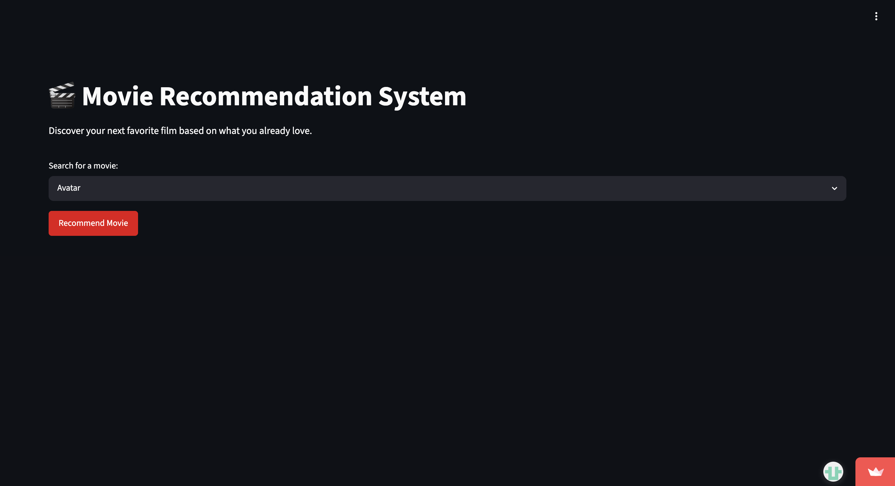
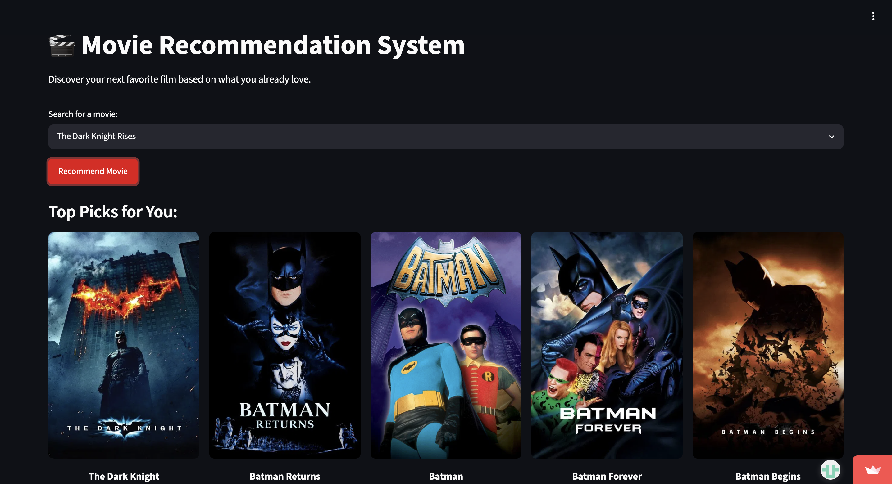

# 🎬 Movie Recommender System

[](#)
[](#)
[](#)

**Try the live app here:** [Launch Movie Recommender](https://movie-rec-system-m3dctkiqtziq7vvwm8vxty.streamlit.app/)


---

## 📱 Application Preview

Below is a live preview of the web interface. Visitors can input features such as parental education level, lunch type, and preparation courses to generate immediate performance model predictions.

### Home Page Interface


### Recomendation


---

# 📌 Overview

This is a **Content-Based Movie Recommender System** built using **Machine Learning** and **Natural Language Processing (NLP)** techniques. The system recommends movies similar to a user's favorite movie by analyzing metadata such as:

* Genres
* Keywords
* Cast
* Crew

The application uses **Cosine Similarity** to measure movie similarity and provides recommendations along with live movie posters fetched from the **TMDB API**.

The frontend is built using **Streamlit** with a clean and responsive UI inspired by modern streaming platforms.

---

# ✨ Features

* 🎯 **Content-Based Filtering** using movie metadata
* 🧠 **NLP-based Feature Engineering**
* 🎬 **Live Movie Poster Fetching** via TMDB API
* ⚡ **Fast Recommendation Engine**
* 🎨 **Modern Streamlit UI**
* 📦 **Pickle-based Model Serialization**
* 🔍 **Top 5 Similar Movie Recommendations**

---

# 🛠️ Tech Stack

| Category         | Technologies              |
| ---------------- | ------------------------- |
| Language         | Python                    |
| Data Processing  | Pandas, NumPy             |
| Machine Learning | Scikit-Learn              |
| NLP              | NLTK                      |
| Frontend         | Streamlit                 |
| Deployment       | Streamlit Community Cloud |
| API              | TMDB API                  |

---

# 🧠 How It Works

## 1. Data Preprocessing

The TMDB Movies and Credits datasets are merged and cleaned to remove unnecessary information.

## 2. Feature Extraction

Important features such as:

* Genres
* Keywords
* Top Cast
* Director

are combined into a single text field called `tags`.

## 3. Text Vectorization

The `tags` data is converted into numerical vectors using:

* `CountVectorizer`
* `PorterStemmer`

## 4. Similarity Calculation

Cosine Similarity is used to calculate similarity scores between movies.

## 5. Recommendation System

When a user selects a movie, the system finds the top 5 most similar movies and displays:

* Movie titles
* Movie posters

---

# 📂 Project Structure

```bash
Movie-Recommender-System/
│
├── app.py
├── Movie-Recommender-System.ipynb
├── movie_dict.pkl
├── similarity.pkl
├── requirements.txt
├── tmdb_5000_movies.csv
├── tmdb_5000_credits.csv
│
├── .streamlit/
│   └── secrets.toml
│
└── README.md
```

---

# 🚀 Run Locally

## 1️⃣ Clone the Repository

```bash
git clone https://github.com/EsJiDee/movie-rec-system.git

cd movie-rec-system
```

---

## 2️⃣ Install Dependencies

```bash
pip install -r requirements.txt
```

---

## 3️⃣ Setup TMDB API Key

This project requires a TMDB API key to fetch movie posters.

### Create `.streamlit/secrets.toml`

```toml
TMDB_API_KEY = "your_api_key_here"
```

You can get your API key from the TMDB website.

---

## 4️⃣ Run the Streamlit App

```bash
streamlit run app.py
```

---

# 📊 Machine Learning Concepts Used

* Content-Based Recommendation
* Cosine Similarity
* Text Vectorization
* NLP Preprocessing
* Stemming
* Feature Engineering

---


# 🔮 Future Improvements

* Add Collaborative Filtering
* User Authentication
* Movie Search Autocomplete
* Hybrid Recommendation System
* Dark/Light Theme Toggle
* Watchlist Feature
